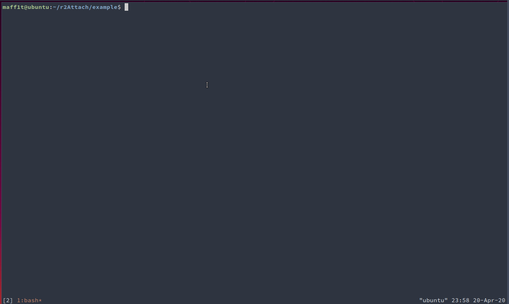

# R2PWN

I was really gelous about gdb.attach() of pwntools, so...
This is a basic python script that can help you for debug your exploits with radare2.
It simply allow you to attach Radare2 to a process opened with pwntools, and spawn another terminal (default tmux) for debugging.
You can pass to it a r2pipe script if you want.



# Usage

Import python module (if you want to import it from anywhere, add it to your PYTHONPATH), create instance of r2Attach class, then call attach() method

Example script
```
from r2Attach import *
from pwn import *

p = process ('./example_bin')
'''
r2script = """
r2.cmd('db sym.imp.puts')
r2.cmd ('dc')
"""
'''
r2script=None
# your exploit
print (p.clean())

r2pwn = r2Attach(p)
r2pwn.attach(r2script)

p.sendline ("5")
print (p.clean())
p.sendline ("A"*10 + "MYSUPEREXPLOIT")
print (p.clean())

p.interactive()
```

# Thanks to:

I took [this](https://gist.github.com/bannsec/43cf0f1b05ec37eb7e92a2922967bc46) work and I keep it simpler.
